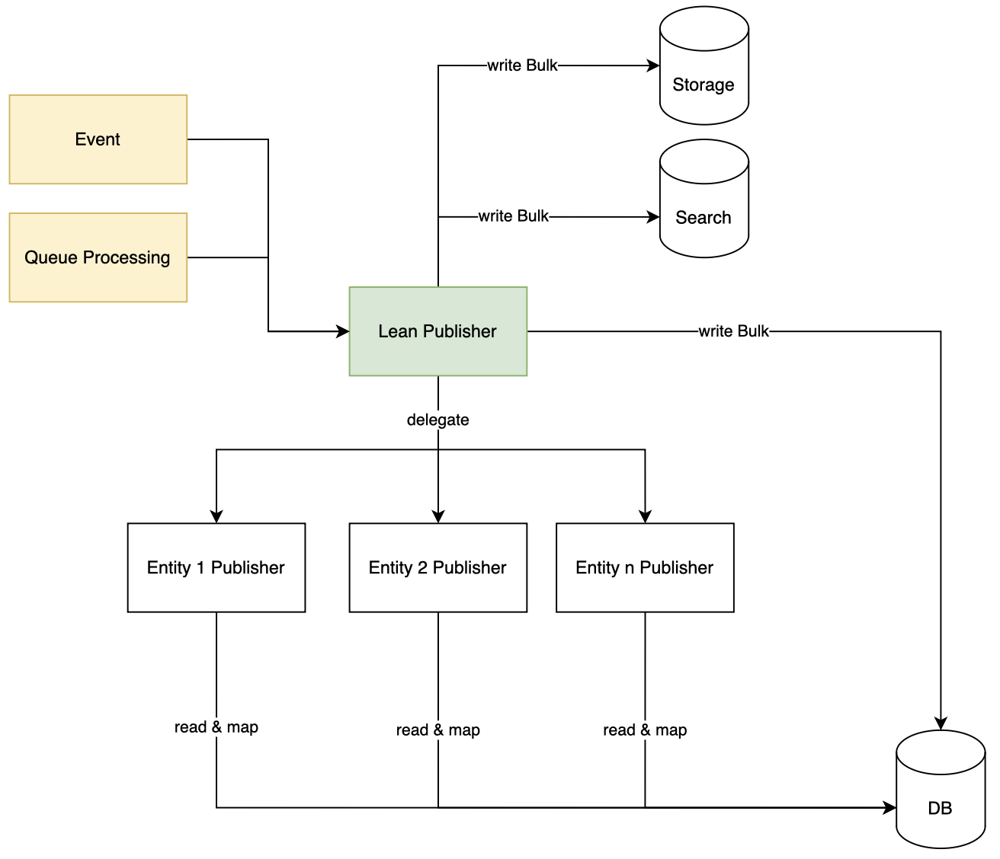

# ALDI Lean Publisher

## Description
The Lean Publisher is a publication process that is based on sprykers "Publish & Synchronize" process (https://docs.spryker.com/docs/scos/dev/back-end-development/data-manipulation/data-publishing/publish-and-synchronization.html).

The goal of this process is to make data available in the frontend-centric data storages like Redis and Elasticsearch.

The Lean Publisher is meant to be used in connection with a spryker system.



## Benefits

1. Lean publisher centralizes all writing operations so that the connected modules do not need to think about bulk publishing
2. The synchronization into Redis and Elasticsearch happens synchronously - preventing out of sync storage data
3. The amount of queues, events and messages is drastically reduced which improves the performance of the RabbitMQ in high throughput environments
4. The event mapping is improved and centralized in one place. Making the connection of the publisher processes easier to understand
5. Provides a guiding structure for the implementing modules, so that there is not too many different approaches to publishing

## Installation
`composer require ALDIDigitalservices/lean-publisher`

## Integration

### config_default.php
add "ALDIDigitalServices" to your CORE_NAMESPACES in config_default.php

```php
$config[KernelConstants::CORE_NAMESPACES] = [
	...
	'ALDIDigitalServices',
	...
];

```
### Console
In `src/Pyz/Zed/Console/ConsoleDependencyProvider.php` please register

```php
[...]
new LeanPublisherResynchronizationConsole(),
[...]
```

todo: Commands

### Event
In `src/Pyz/Zed/Event/EventDependencyProvider.php` register

```php
[...]
$eventSubscriberCollection->add(new LeanPublisherEventSubscriber());
[...]
```

## Connecting your module to the Lean Publisher
If you want to connect your entity to the Lean Publisher you need to follow these steps:

#### Step 1: Create your publishing module
We suggest starting a module with "<ENTITY_NAME>Publish". So for example CategoryPublish, MerchantPublish etc.

#### Step 2: Create a new queue + retry queue
in `src/Pyz/Zed/Queue/QueueDependencyProvider.php` using the `LeanPublisherQueueMessageProcessorPlugin`
```php
[...]
<ENTITY_NAME>PublishConfig::PUBLISH_MY_ENTITY_QUEUE_NAME => new LeanPublisherQueueMessageProcessorPlugin(),
<ENTITY_NAME>PublishConfig::PUBLISH_MY_ENTITY_RETRY_QUEUE_NAME => new EventRetryQueueMessageProcessorPlugin()
[...]
```

#### Step 3: Register retry and error configuration in
In `src/Pyz/Client/RabbitMq/RabbitMqConfig.php` add
```php
[...]
<ENTITY_NAME>PublishConfig::PUBLISH_<MY_ENTITY>_QUEUE_NAME => [
    static::ROUTING_KEY_RETRY => <ENTITY_NAME>PublishConfigConfig::PUBLISH_<ENTITY_NAME>_RETRY_QUEUE_NAME,
    static::ROUTING_KEY_ERROR => <ENTITY_NAME>PublishConfigConfig::PUBLISH_<ENTITY_NAME>_ERROR_QUEUE_NAME,
],
[...]
```

Setup the new registered queue via console command.
`docker/sdk console queue:setup`

#### Step 4: Create a database table that follows the Lean Publisher conventions
```xml
<?xml version="1.0"?>
<database xmlns="spryker:schema-01" xmlns:xsi="http://www.w3.org/2001/XMLSchema-instance" name="zed"
          xsi:schemaLocation="spryker:schema-01 https://static.spryker.com/schema-01.xsd"
          namespace="Orm\Zed\<MyModule>\Persistence"
          package="src.Orm.Zed.<MyModule>.Persistence">

    <table name="MY_ENTITY_publish" identifierQuoting="true">
        <column name="id_MY_ENTITY_publish" required="true" type="INTEGER" autoIncrement="true"
                primaryKey="true"/>
        <column name="reference" required="true" type="VARCHAR" size="255"/>
        <column name="key_search" type="VARCHAR" size="255" />
        <column name="key_storage" type="VARCHAR" size="255" />
        <column name="data_search" type="LONGVARCHAR" />
        <column name="data_storage" type="LONGVARCHAR" />
        <column name="store" type="VARCHAR" size="128" required="true"/>

        <index name="MY_ENTITY_publish-reference">
            <index-column name="reference"/>
        </index>

        <unique name="MY_ENTITY_publish-unique-key_storage">
            <unique-column name="key_storage"/>
        </unique>
        <unique name="MY_ENTITY_publish-unique-key_search">
            <unique-column name="key_search"/>
        </unique>

        <id-method-parameter value="id_MY_ENTITY_publish_pk_seq"/>

        <behavior name="timestampable"/>
    </table>

</database>
```

Create the new table via the console command:

`docker/sdk console propel:schema:copy && docker/sdk console propel:model:build && docker/sdk console propel:diff && docker/sdk console propel:migrate && docker/sdk console transfer:entity:generate`

#### Step 5: Create an EventHandler Plugin that implements Lean Publisher Interfaces
Interface | Description
--- |---
LeanPublisherEventHandlerPluginInterface | general Lean Publisher event handler interface. Needed for communication with the Lean Publisher.
LeanPublisherStoragePublishPluginInterface | If you want to publish to storage, you need this interface.
LeanPublisherSearchPublishPluginInterface | If you want to publish to search, you need this interface.


#### Step 6: Register the EventHandler
In `src/Pyz/Zed/LeanPublisher/LeanPublisherDependencyProvider.php::getEventHandlerPlugins()`

```php
return [
    [...]
    <ENTITY_NAME>PublishConfig::PUBLISH_<ENTITY_NAME>_QUEUE_NAME => new <ENTITY_NAME>PublishEventHandlerPlugin(),
    [...]
];
```
#### Step 7: Create and register a PublisherTriggerPlugin
Create a PublishTriggerPlugin implementing **both** PublisherTriggerPluginInterface, LeanPublisherTriggerPluginInterface and set it up in
`\Pyz\Zed\Publisher\PublisherDependencyProvider::getPublisherTriggerPlugins`

```php
return [
    [...]
     new <ENTITY_NAME>PublishPublisherTriggerPlugin(),
     [...]
];
```

#### Step 8: Set up jobs to process the events
Depending on your setup you need to add jenkins jobs or other jobs to process messages from your `publish.ENTITY_NAME` queue
